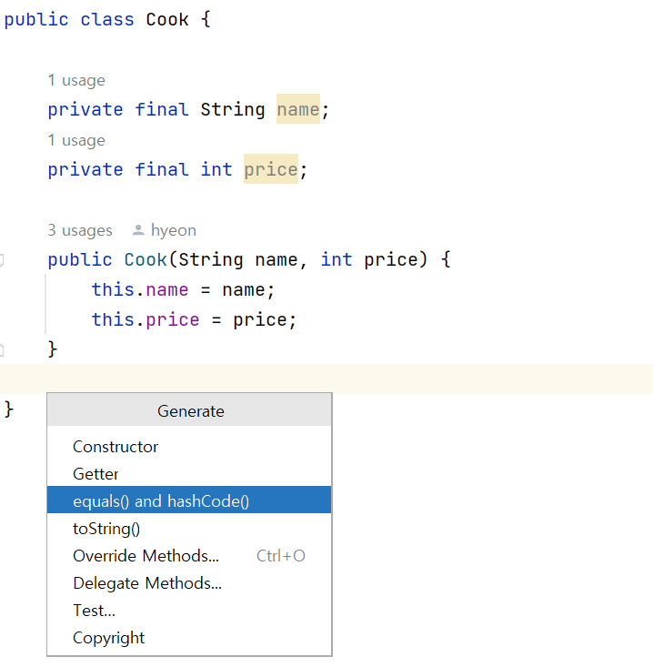

# 음식점 주문

## 기술 스택

https://simpleicons.org/

<br>

## 구현 기능

### 기능 1

### 기능 2

### 기능 3

### 기능 4

<br>

## 배운 점

1. 객체 지향 구현 단계  
   (1) 도메인을 구성하는 객체 고려  
   (2) 객체들 간의 관계  
   (3) 도메인 모델링 - 동적 객체를 정적 타입으로 추상화  
   (4) 협력  
   (5) 책임 할당 - 객체를 포괄하는 타입
2. <b>alt+Insert를 암기할 때가 됐다</b>
3. 클래스 생성 테스트 기본 코드도 암기할 때가 됐다(매개변수 없이 넘기기)
   ```java
      assertThatCode(()->new Cook("만두", 5000))
            .doesNotThrowAnyException(); //어떤 예외도 발생하지 않을거라는 단언
   ```
4. 객체 생성 후 바로 리턴 -> 함수 구현은 안 했지만 테스트 코드는 통과하기 위해서
```java
    return new Cook("돈까스", 5000);
```
5. 객체를 비교할 때는 isEqualTo는 그대로 사용하되 equals와 hashcode를 객체 클래스에서 오버라이딩 해야 함  
   -> alt+insert로 equals ans hashcode 선택    
   - 비교 당하는 객체에서 오버라이딩 추가!, ex)메뉴판-메뉴 아이템에서는 메뉴 아이템을 수정해야 함
6. 한 번에 생성자 여러 개 만들기: <b>List.of</b>
```java
new Menu(List.of(new MenuItem("돈까스", 5000),
            new MenuItem("냉면", 7000)));
```
7. findFrist: 스트림의 filter 결과 중 1개만 가져옴
8. 예외 발생도 제대로 하는지 확인해야 함
```java
   return this.menuItems.stream()
        .filter(menuItem -> menuItem.matches(name))
        .findFirst()
        **.orElseThrow(()->new IllegalArgumentException("잘못된 메뉴 이름"))**;

@Test
    void chooseTest2() {
            Menu menu = new Menu(List.of(new MenuItem("돈까스", 5000), new MenuItem("냉면", 7000)));

            assertThatCode(()->menu.choose("통닭"))
            **.isInstanceOf(IllegalArgumentException.class)**
        .hasMessage("잘못된 메뉴 이름");
        }
```
<br>

## 라이센스

MIT &copy; [NoHack](mailto:lbjp114@gmail.com)
