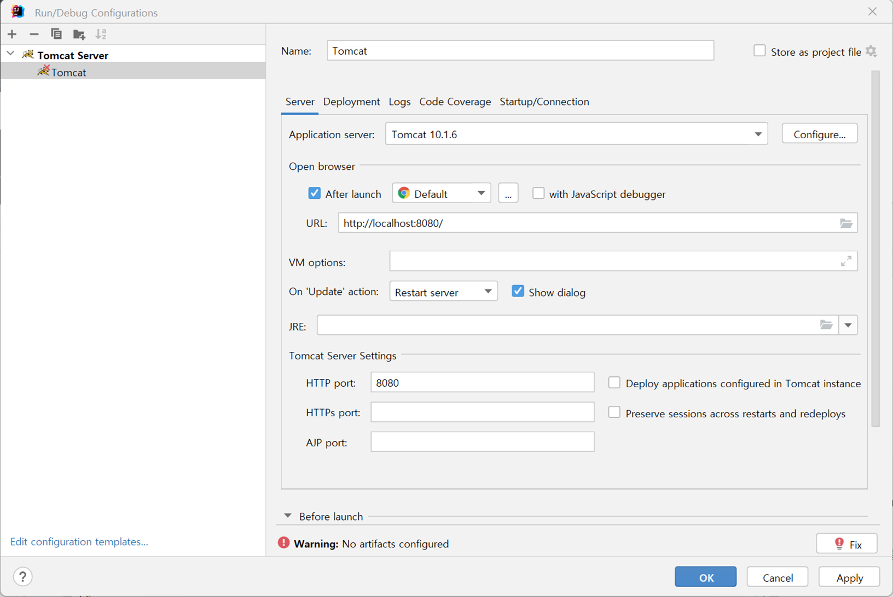
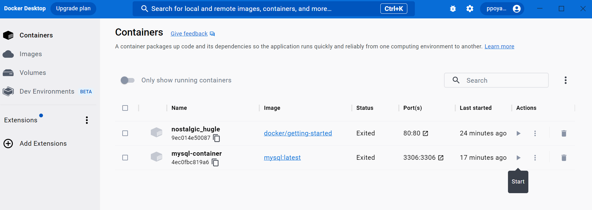
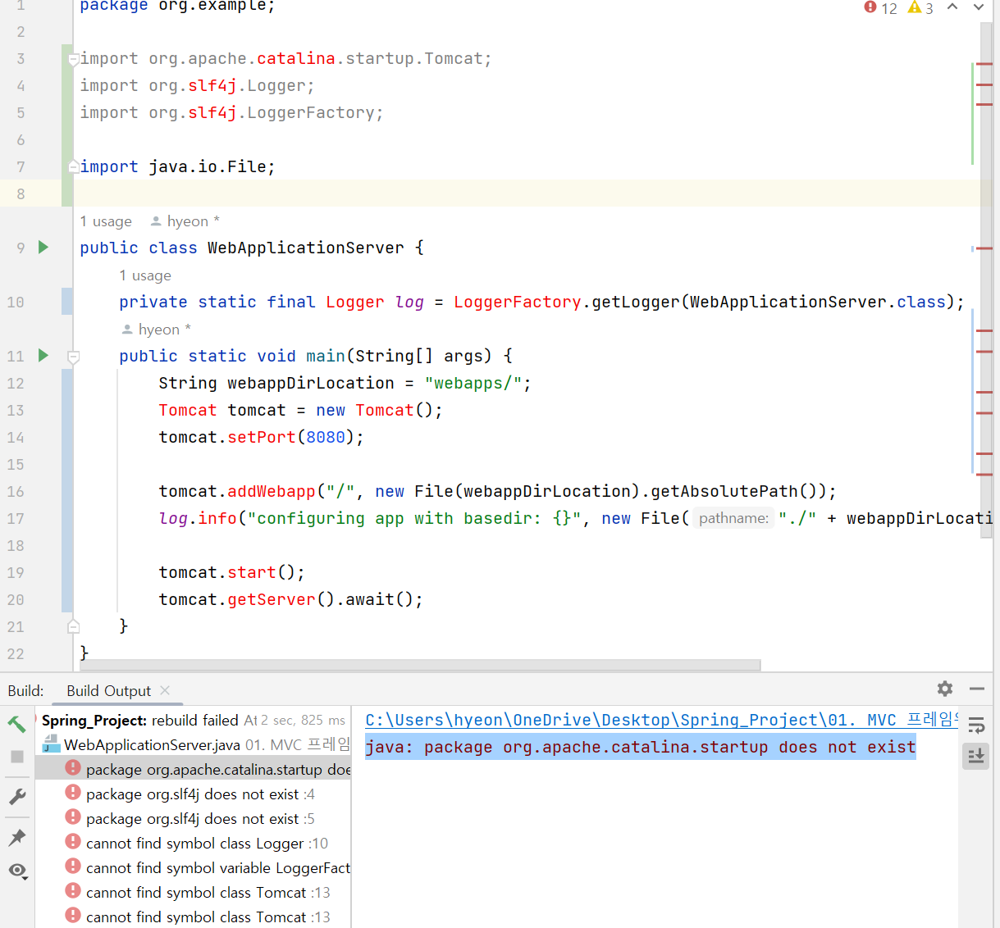
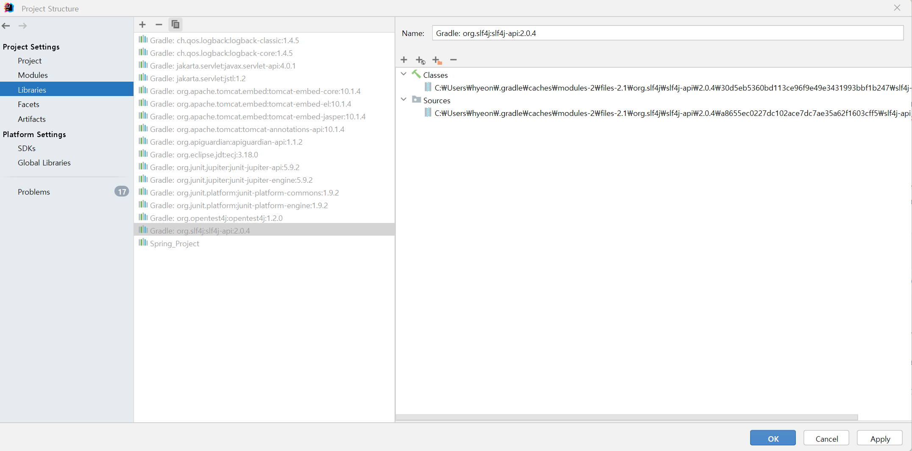
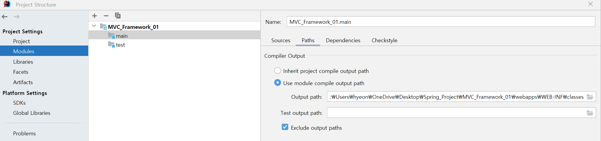

# MVC_Framework를 위한 기초 환경 세팅 및 이론

## 소개

1. Spring 환경에 내장형 톰캣을 연동했습니다.
2. Docker-Compose를 활용해 MySQL을 구동했습니다.
3. TDD&BDD 이론을 학습했습니다.

## 기술 스택

## 배운 점

1. 톰캣을 다운로드 받은 후 파일을 progamefile과 같은 폴더에 직접 옮기고 인텔리제이에서 경로를 설정해야 하는 줄 알았음, 
그럴필요 없이 powershell/cmd로 .\startup.sh 또는 .\startup.bat  

2. 내장형 톰캣과 서블릿을 사용한 MVC 웹 방법  
-> build.gradle에 개발 설정 참고  
2-1) 외부 톰캣 연동 방법: https://goddaehee.tistory.com/247
   
  
3. Lombok: Java 라이브러리로 반복 메서드 작성 코드를 줄여준다
4. 도커 허브: 도커에서 제공하는 이미지 저장소, 도커 컴포즈: 다중 컨테이너를 정의하고 실행 & YAML 파일 사용해 다중 컨테이너 구성 

|  도커 사용법   |
|:---------:|
- MySQL 이미지 가져오기: docker pull mysql  
- MySQL 컨테이너 생성: docker run --name *mysql-container* -e MYSQL_ROOT_PASSWORD=*root* -d -p 3306:3306 mysql:*latest*  
    *원하는 컨테이너 이름, MySQL 루트 계정의 비밀번호, MySQL 이미지 버전*  
- MySQL 컨테이너 접속: docker exec -it *mysql-container* bash  
    *컨테이너 이름*  
5. Junit5: 자바 단위 테스팅 프레임 워크
6. AssertJ: 테스트 코드 가독성을 높여 주는 자바 라이브러리
   - 테스트 코드 작성 이유  
     (1) 문서화 역할  
     (2) 코드에 있는 결함 발견  
     (3) 리팩토링시 안정성 확보  
     (4) 테스트 하기 쉬운 코드로 작성하면서 더 낮은 결합도의 설계 가능   
7. TDD(Test Driven Developement):  
    - 프로덕션 코드보다 테스트 코드를 먼저 작성하는 개발 방법
    - TFD(Test Frist Development) + **리팩토링(중요)**
    - 기능 동작 검증(메소드 단위)
8. BDD(Behavior Driven Development): 
    - 시나리오 기반으로 테스트 코드를 작성하는 개발 방법
    - 시나리오는 **Given, When, Then** 구조를 가진다
 

## 오류 및 해결
(1) The JRE_HOME environment variable is not defined correctly
  
✔️ 해결  
자바를 다른 버전으로 다운 받고 환경 변수를 업데이트 하지 않아서 생긴 일로 환경 변수를 수정해주었다

(2) build.gradle 작성 후에도 import 인식이 안 됨

✔️ 해결 
1. rebuild -> 해결 안 됨
2. 캐시 비우고 재실행 -> 해결 안 됨
3. gradle의 javax를 jakarta로 변경 -> 해결 안 됨
4. gradle을 해결했으나 패키지 인식을 못 함 -> 파일/모듈명을 모두 영어로 변경 + 패키지를 전체 경로로 작성 + Mark 설정 
5.  -> 비활성 돼 있어서 될 때까지 캐시 초기화, 라이브러리 추가/삭제, 모듈 추가/삭제 반복 하니 에러 해결  
6. 톰캣 서버 구동할 때 webapps 폴더가 생성이 안 될 때 경로 수정 
자바 프로젝트 안에 또 다른 프로젝트를 만들어서 에러가 발생한 것! -> 프로젝트를 따로 여니 문제 완전히 해결!!

## 라이센스

MIT &copy; [NoHack](mailto:lbjp114@gmail.com)
