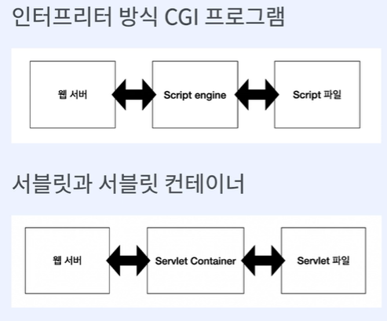
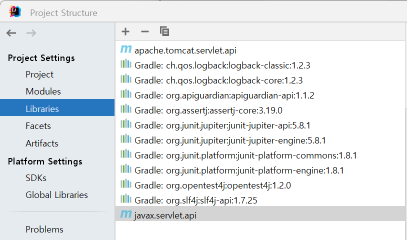
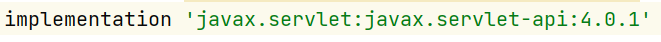
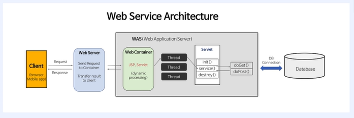
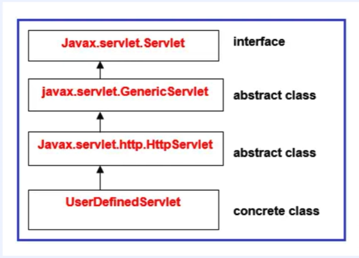
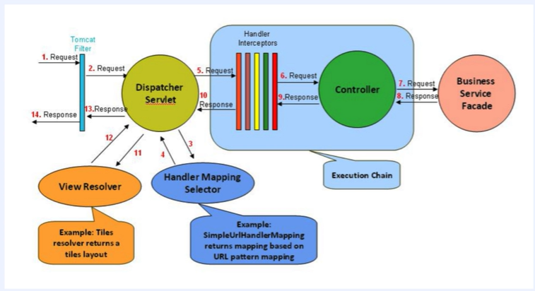
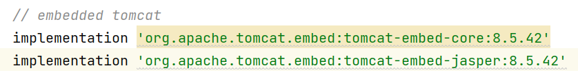
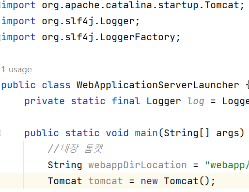

# 계산기 웹 프로그램

## 기술 스택


## 구현 기능

#### 1. Main에서 CustomerWebApplicationServer를 구동하면 test.http에 정의한 URL과 통신한 결과를 log로 출력한다
#### 2. URL을 가공하여 이전에 만든 Calculator로 계산한 값을 HttpResponse로 응답한다
#### 3. 내장 톰캣을 사용 해 웹 서블릿 계산기를 구동한다
## 배운 점

#### WebApplication(톰캣)을 직접 구현함으로써, HTTP 프로토콜의 형태와 동작을 파악

1. Thread: 쓰레드 풀
2. HTTP

- HTTP/1.1 & HTTP/2: TCP 기반, HTTP/3: UDP 기반
- 클라이언트-서버 모델
- 무상태 프로토콜: 서버가 클라이언트 상태 유지하지 않음<b>(대안: Keep-Alive)</b>
- 비연결성: 서버가 클라이언트 요청에 응답을 마치면 연결을 끊어버림<b>(대안:쿠키, 세션, JWT)</b>
- 메서드: Get, Post, Put, Delete 등
- 응답 코드: 2xx(성공), 3xx(리다이렉션), 4xx(클라이언트 에러), 5xx(서버 에러) 등
- 헤더 구조
  
     
  GET ~ HTTP/1.1까지 헤더의 첫 줄을 <b>reqeust line</b>이라고 한다
  -> split해서 queryString만 가져와서 처리한다
- <b>요청 클래스 설계</b>
    - HttpReqeust(요청): RequestLine(HttpMethod path queryString protocol/version),Header(리퀘스트 라인만
      사용하면 돼서 얘도 별 쓸모 없음), Body(요청 메시지는 헤더와 바디 사이에 blank line 있지만 공백이라 생략)
    - HttpResponse(응답)->로그로 출력: Header, Body

3. LoggerFactory

- gradle 오류

```java
testImplementation'com.github.mcpat.slf4j:slf4cldc-api:1.6.0'->아님
    implementation'ch.qos.logback:logback-classic:1.2.3'
```

- <a href="https://juinor.tistory.com/40">SLF4j</a>

4. 프로젝트의 gradle을 intelliJ로 변경하면 좀 더 빠르게 수행할 수 있다
   
5. Http.Request 파일: http 테스트를 수행할 수 있음
6. try-catch문
    - 괄호: Statement Class의 인스턴스나 Stream 타입의 클래스들이 동작후 필요로하는 close() 메소드를 자동 실행 해주는 공간  
      -> close 메소드를 작성하지 않아도 됨
    - 여러 개 생성 가능
    ```java
    try(InputStream inputStream = clientSocket.getInputStream();OutputStream outputStream = clientSocket.getOutputStream() )
    ```
7. inputStream을 line-by-line으로 읽기: BufferedReader로 감싸줌

```java
BufferedReader br=new BufferedReader(new InputStreamReader(inputStream,StandardCharsets.UTF_8));
```

8. isEqualTo를 객체에 사용할 때는 항상 오버라이딩 염두!
9. 새로운 class를 만들기 전 테스트 클래스에서 isNotNull 테스트를 먼저 수행한다
10. 여러 개의 객체를 다룰 필요가 있음 -> List<객체> : 1급 컬렉션
11. 사용하는 곳에서 바로 만들지 않고, 수행 해야 할 클래스를 사용해서 작성해준다 -> 객체 지향

```java
public boolean isGetRequest(){
    return requestLine.isGetRequest(); //requestLine 클래스에 새로 isGetRequest 메소드 생성해서 처리한다
    }
```

12. Thread 생성 방식 발전 단계

- 메인 Thread 하나가 처리: 모든 요청을 쓰레드 하나에서 처리하다 보니 쓰레드에 blocking이 걸리면 그 뒤의 요청들도 처리가 안 됨 -> 따로 Thread 생성 안
  하고 Main에서 Client 호출 및 동작 수행 함   
  <b>아래 방법부터는 쓰레드를 새로 작성</b>
- 사용자 요청이 들어올 때마다 Thread를 새로 생성: 요청이 들어올 때마다 메모리를 계속 할당해야 해서 성능이 떨어짐
- Thread Pool 적용: 고정된 개수만큼 생성한 후 그 안에서 재활용한다 -> ExecutorService(new, 팩토리 메서드)

13. <a href="https://www.daleseo.com/java-thread-runnable/">Thread 구현 방법 2가지</a>
    (1) Thread 클래스  
    (2) Runnable 인터페이스  
    -> 구현은 미세하게 Thread 클래스가 편리하나 다중 상속, 확장성을 고려하면 Runnable 인터페이스 사용이 더 적합하다
14. CGI(Common Gateway Interface)

- 웹 서버와 애플리케이션 사이에 데이터를 주고 받는 규약
- CGI 규칙을 따라 만든 프로그램을 CGI 프로그램이라고 한다
- CGI 프로그램 종류: 컴파일 방식(C/C++/Java), 인터프리터 방식(PHP, 파이썬)
  

15. 서블릿(Servlet: Server+Applet)  
- 호출 규약
- 자바에서 웹 애플리케이션을 만드는 기술
- 자바에서 동적인 웹 페이지를 구현하기 위한 표준
  -> CGI를 서블릿이 대신 해줌  
- @WebServlet 어노테이션: 지정한 URL이 들어오면 선언한 클래스의 서블렛이 실행 됨
 -> 이것만으론 ClassPath 생성이 안 됨

16. 서블릿 컨테이너

- 서블릿의 생성부터 소멸까지의 라이프 사이클을 관리해주는 역할
- 서블릿 컨테이너는 웹 서버와 소켓을 만들고 통신하는 과정을 대신 처리해준다
  -> <b>개발자는 비즈니스 로직에 집중</b>
- 서블릿 객체를 <b>싱글톤</b>(인스턴스 하나만 생성 후 공유)으로 관리한다
- 싱글톤의 특징
    - <b>상태를 유지(stateful)하게 설계하면 안 됨</b>: 멀티 쓰레드 환경에서 하나의 자원(객체)을 공유하게 돼
      <b>레이스 컨디션</b>이 발생한다 - <b>동기화 처리</b> 필수
      -> 동기화를 사용해 싱글톤 패턴에서 스레드의 상태를 유지할 수 있지만, 안 하는게 좋다
    - Thread saftey 하지 않음

17. 서블릿 컨테이너 vs WAS

- WAS는 서블릿 컨테이너를 포함하는 개념이다
- WAS는 매 요청마다 스레드 풀에서 기존 스레드를 사용한다
- WAS의 주요 튜닝 포인트는 max thread 수
- 대표적인 WAS가 톰캣
    

18. 서블릿 인터페이스  


- 서블릿 컨테이너가 서블릿 인터페이스에 있는 메소드들을 호출 함
- 서블릿 생명 주기와 관련된 메소드: init(초기화-환경 설정), service(주요 동작), destroy
- 서블릿 기타 메소드: getServletConfig, getServletInfo  
- 오버라이딩 하는 메소드: 
  - Servlet 인터페이스: init, service, destroy, getServletConfig, getServletInfo
  - GenericServlet 추상 클래스: service
  - HttpServlet 추상 클래스: do+HTTP메소드(해당 프로젝트에선 doGet)
19. URL 인코딩(퍼센트 인코딩) 
- URL로 사용할 수 없는 문자(예약어, Non-Ascii 문자)를 %다음 16진수로 표현 함
- 예시: GET http://localhost:8080/calculate?operand1=11&operator=+&operand2=55 : 에러 발생(+는 예약어)  
->GET http://localhost:8080/calculate?operand1=11&operator=%2b&operand2=55

20. 내장형 톰캣 환경 설정  


<br>

## 라이센스

MIT &copy; [NoHack](mailto:lbjp114@gmail.com)
