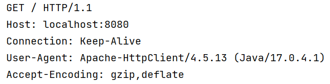
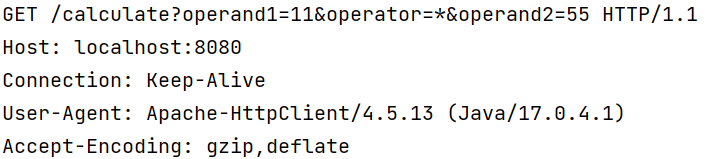
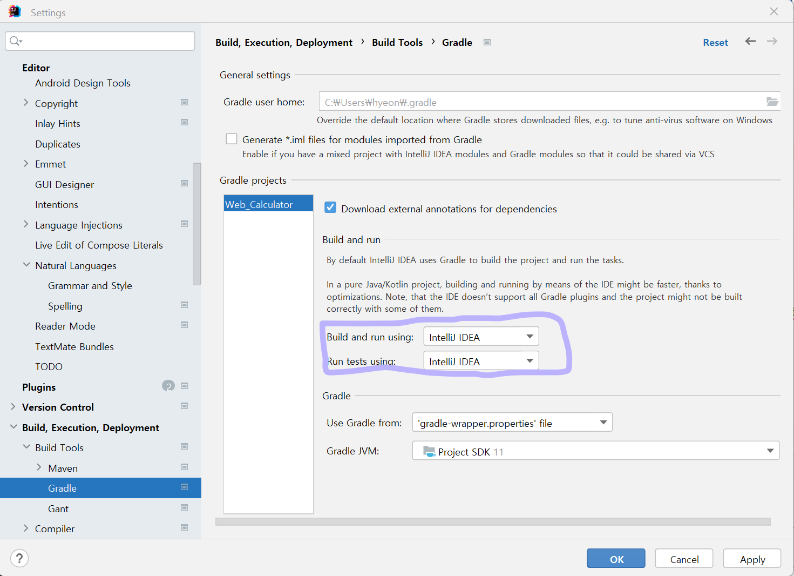

# 계산기 웹 프로그램

## 기술 스택


## 구현 기능

#### 1. Main에서 CustomerWebApplicationServer를 구동하면 test.http에 정의한 URL과 통신한 결과를 log로 출력한다

#### 2. URL을 가공하여 이전에 만든 Calculator로 계산한 값을 HttpResponse로 응답한다.

## 배운 점
#### WebApplication(톰캣)을 직접 구현함으로써, HTTP 프로토콜의 형태와 동작을 파악
1. Thread: 쓰레드 풀
2. HTTP 
- HTTP/1.1 & HTTP/2: TCP 기반, HTTP/3: UDP 기반
- 클라이언트-서버 모델
- 무상태 프로토콜: 서버가 클라이언트 상태 유지하지 않음<b>(대안: Keep-Alive)</b>
- 비연결성: 서버가 클라이언트 요청에 응답을 마치면 연결을 끊어버림<b>(대안:쿠키, 세션, JWT)</b>
- 메서드: Get, Post, Put, Delete 등
- 응답 코드: 2xx(성공), 3xx(리다이렉션), 4xx(클라이언트 에러), 5xx(서버 에러) 등
- 헤더 구조

 
GET ~ HTTP/1.1까지 헤더의 첫 줄을 <b>reqeust line</b>이라고 한다
-> split해서 queryString만 가져와서 처리한다
- <b>요청 클래스 설계</b>
   - HttpReqeust(요청): RequestLine(HttpMethod path queryString protocol/version),Header(리퀘스트 라인만 사용하면 돼서 얘도 별 쓸모 없음), Body(요청 메시지는 헤더와 바디 사이에 blank line 있지만 공백이라 생략)
   - HttpResponse(응답)->로그로 출력: Header, Body
3. LoggerFactory
  - gradle 오류 
```java
testImplementation 'com.github.mcpat.slf4j:slf4cldc-api:1.6.0' -> 아님
implementation 'ch.qos.logback:logback-classic:1.2.3'
```
- <a href="https://juinor.tistory.com/40">SLF4j</a>
4. 프로젝트의 gradle을 intelliJ로 변경하면 좀 더 빠르게 수행할 수 있다

5. Http.Request 파일: http 테스트를 수행할 수 있음
6. try-catch문
   - 괄호: Statement Class의 인스턴스나 Stream 타입의 클래스들이 동작후 필요로하는 close() 메소드를 자동 실행 해주는 공간  
    -> close 메소드를 작성하지 않아도 됨 
   - 여러 개 생성 가능
    ```java
    try(InputStream inputStream = clientSocket.getInputStream();OutputStream outputStream = clientSocket.getOutputStream() )
    ```
7. inputStream을 line-by-line으로 읽기: BufferedReader로 감싸줌
```java
BufferedReader br = new BufferedReader(new InputStreamReader(inputStream, StandardCharsets.UTF_8 ));
```
8. isEqualTo를 객체에 사용할 때는 항상 오버라이딩 염두!
9. 새로운 class를 만들기 전 테스트 클래스에서 isNotNull 테스트를 먼저 수행한다
10. 여러 개의 객체를 다룰 필요가 있음 -> List<객체> : 1급 컬렉션
11. 사용하는 곳에서 바로 만들지 않고, 수행 해야 할 클래스를 사용해서 작성해준다 -> 객체 지향
```java
public boolean isGetRequest() {
    return requestLine.isGetRequest(); //requestLine 클래스에 새로 isGetRequest 메소드 생성해서 처리한다
    }
```
12. Thread 생성 방식 발전 단계
- 메인 Thread 하나가 처리: 모든 요청을 쓰레드 하나에서 처리하다 보니 쓰레드에 blocking이 걸리면 그 뒤의 요청들도 처리가 안 됨 -> 따로 Thread 생성 안 하고 Main에서 Client 호출 및 동작 수행 함   
<b>아래 방법부터는 쓰레드를 새로 작성</b>  
- 사용자 요청이 들어올 때마다 Thread를 새로 생성:
- Thread Pool 적용: 
13. <a href="https://www.daleseo.com/java-thread-runnable/">Thread 구현 방법 2가지</a>
    (1) Thread 클래스  
    (2) Runnable 인터페이스  
-> 구현은 미세하게 Thread 클래스가 편리하나 다중 상속, 확장성을 고려하면 Runnable 인터페이스 사용이 더 적합하다
<br>

## 라이센스

MIT &copy; [NoHack](mailto:lbjp114@gmail.com)
